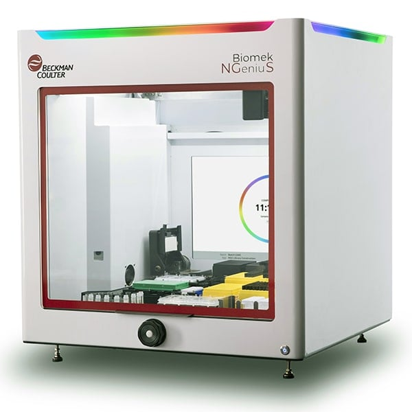

## BeckmanCoulter Projects

<table>
  <tr>
    <td align="center" width="150px"><a href="https://github.com/BeclsAutomation/NGSPrepCustomerPortalUI" target="_blank"> <b>Vision</b></a></td>
    <td align="center" width="150px"><a href="https://github.com/BeclsFlow/eIQAP-UI" target="_blank"> <b>IQAP</b></a></td>
    <td align="center" width="150px"><a href="https://github.com/BeclsFlow/FlowIntegrationPlatform" target="_blank"> <b>Flow Ecosystem</b></a></td>
  </tr>
</table>

## Personal Projects

<table>
  <tr>
    <td align="center" width="150px"><a href="https://github.com/BeclsUser/szhong-halloween" target="_blank"> <b>szhong-halloween</b></a></td>
    <td align="center" width="150px"><a href="https://github.com/BeclsUser/szhong-nationalday" target="_blank"> <b>szhong-nationalday</b></a></td>
    <td align="center" width="150px"><a href="https://github.com/BeclsUser/szhong-doc-template" target="_blank"> <b>szhong-doc-template</b></a></td>
    <td align="center" width="150px"><a href="https://github.com/BeclsUser/szhong-becls-auth-ts" target="_blank"> <b>szhong-becls-auth-ts</b></a></td>
  </tr>
</table>
